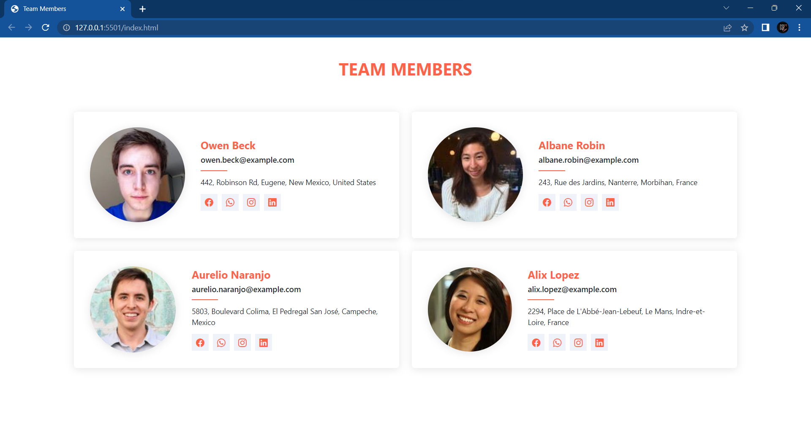
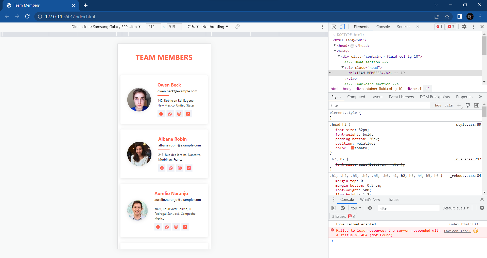
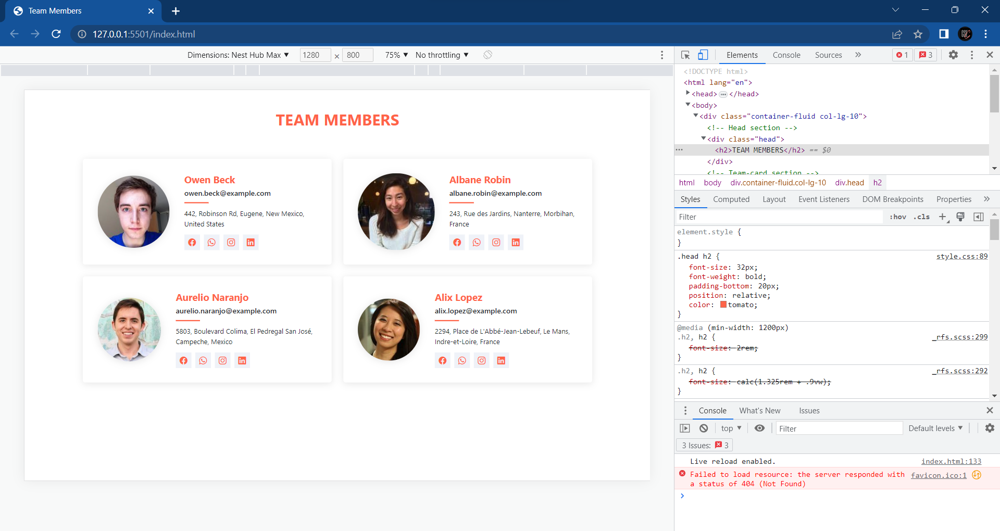

# Team Members Page

This is a page or section that displays information about team members.

## Description

This is a team members section built using Bootstrap 5. It displays information of the team members in a cards like structure. Each member has a profile picture, name, job title and a short description of their role. Additionally, each member has links to their social media accounts. This is completely responsive on all devices and has a mobile first design because of bootstrap.

## Technologies Used

* HTML
* CSS
* Bootstrap 5

## Getting started

1. Clone the repository <a href="https://github.com/Thirumalaikumar-M/TeamMembers_Page.git">https://github.com/Thirumalaikumar-M/TeamMembers_Page.git</a>
2. Open `index.html` in your preferred web browser
3. Or else try the <a href="https://thirumalaikumar-m.github.io/TeamMembers_Page/">Github hosted page</a> .

## Screenshots

## Acknowledgment

The profile pictures used in this webpage are placeholders and do not represent any real people. Images are sourced from open licensed free image platforms on internet. And the information about the members are randomly described.

## Contributions

Contributions are welcome! Please open an issue or submit a pull request if you have any suggestions or improvements.

## License

This application is released under the . Feel free to use, modify and distribute your code under the terms of the MIT license.
